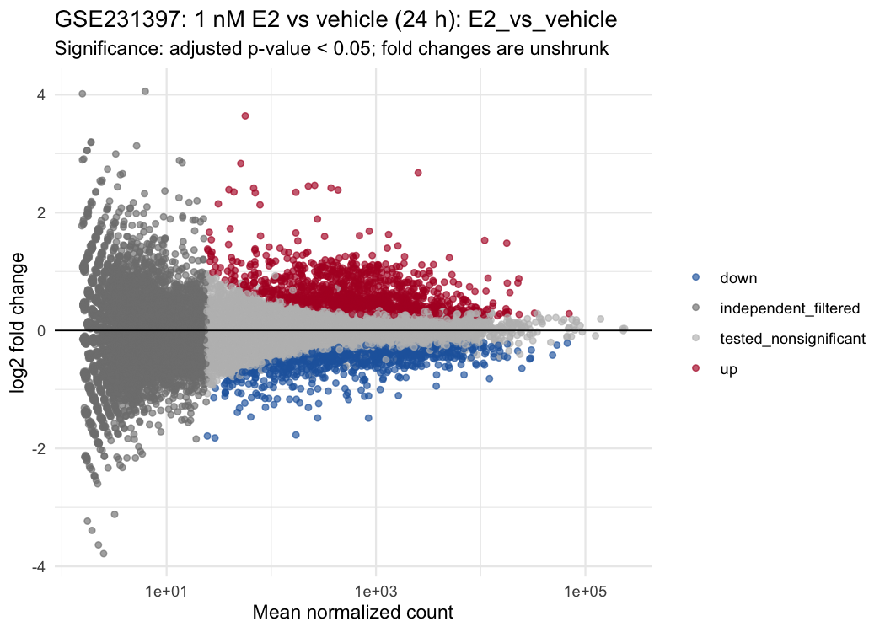
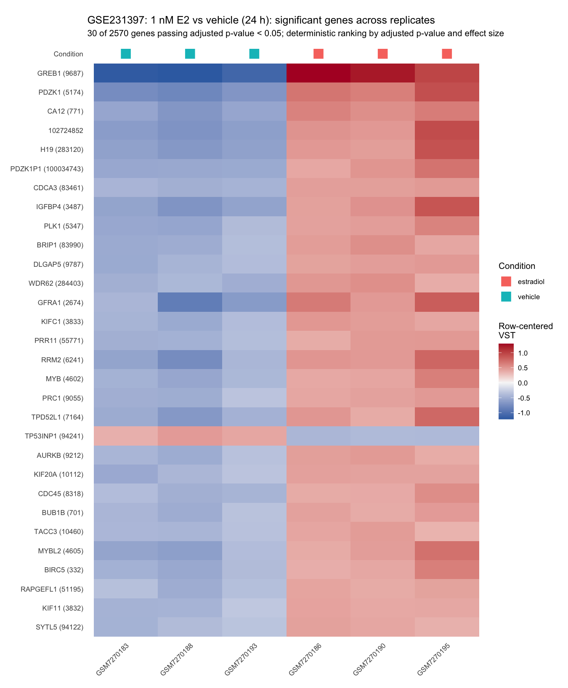

# Bulk RNA-seq downstream analysis in R

An R workflow for quality control, DESeq2 differential expression, replicate-level visualization, and a reviewable HTML report from an integer gene-count matrix. The workflow pattern was developed during my postdoctoral work at Van Andel Institute; this repository packages it around an independent public-data example.

## Dataset and design

The main example uses [GSE231397](https://www.ncbi.nlm.nih.gov/geo/query/acc.cgi?acc=GSE231397), from Min et al. (*PNAS*, 2024): steroid-deprived MCF-7 cells treated for 24 hours with either vehicle or 1 nM 17beta-estradiol (E2), with three biological replicates per condition.

- Comparison: E2 versus vehicle
- Model: `~ condition`
- Input: NCBI-generated GRCh38.p13 gene counts (HISAT2/featureCounts)
- Filtering: total count >= 10
- Significance: Benjamini-Hochberg adjusted p-value < 0.05

The six samples are independent biological replicates; no pairing or unreported batch term is added.

## Run the public example

From the repository root:

```sh
./example/gse231397/download_data.sh
Rscript --vanilla run_analysis.R config/gse231397_e2_vs_vehicle.R
```

The download script retrieves the NCBI count archive and GEO metadata, verifies SHA-256 checksums and sample identities, and prepares the six-sample matrix. The analysis writes:

- `output/gse231397_e2_vs_vehicle/rnaseq_downstream.html`
- a complete DESeq2 table and normalized counts under `output/gse231397_e2_vs_vehicle/tables/`
- PCA, correlation, MA, volcano, and significant-gene heatmaps under `output/gse231397_e2_vs_vehicle/figures/`

Exact accessions, checksums, and sample selection are recorded in [the provenance note](example/gse231397/PROVENANCE.md). The workflow requires R, Pandoc, `rmarkdown`, `knitr`, `ggplot2`, `DESeq2`, and `SummarizedExperiment`.

## Results

Of 20,488 tested genes, 2,570 passed FDR 0.05: 1,499 had positive and 1,071 had negative unshrunk log2 fold changes for E2 versus vehicle. PCA separated the treatment groups along the first component.

The compact [contrast summary](results/gse231397/contrast_summary.csv) and [published-target comparison](results/gse231397/published_target_concordance.csv) are tracked with the repository; the complete tables are generated locally.



*Mean expression versus unshrunk DESeq2 log2 fold change; colored points pass FDR 0.05.*



*Row-centered variance-stabilized counts for the 30 highest-ranked significant genes, with all six replicates shown.*

## Comparison with the published study

The paper reports estrogen-responsive transcription in MCF-7 cells and specifically examines the ER target genes *GREB1*, *PGR*, and *TFF1*. All three change in the expected positive direction in this E2-versus-vehicle reanalysis:

| Gene | NCBI Gene ID | log2 fold change | adjusted p-value |
| --- | ---: | ---: | ---: |
| *GREB1* | 9687 | 2.67 | 1.29e-143 |
| *PGR* | 5241 | 2.83 | 1.27e-15 |
| *TFF1* | 7031 | 1.48 | 5.23e-6 |

This is directional concordance for named estrogen-response genes, not a reproduction of the paper's complete analysis. The repository starts from NCBI-standardized counts and applies its own filtering and DESeq2 model; the publication used the dataset within a broader receptor pharmacology study and did not define the same genome-wide contrast summary.

## Scope and limitations

The workflow starts from integer gene counts. Alignment, transcript quantification, and raw-read QC are upstream. DESeq2 median-ratio normalization assumes that most genes do not undergo a common directional shift. With three replicates per condition, results support this worked example but do not establish clinical or causal conclusions.

## Citation

Min CK et al. [Asymmetric allostery in estrogen receptor-alpha homodimers drives responses to the ensemble of estrogens in the hormonal milieu](https://doi.org/10.1073/pnas.2321344121). *PNAS*. 2024. Public data: [GSE231397](https://www.ncbi.nlm.nih.gov/geo/query/acc.cgi?acc=GSE231397).

No repository license has been selected.
