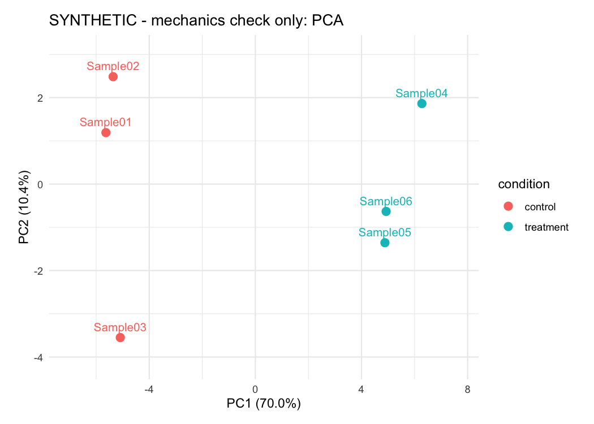
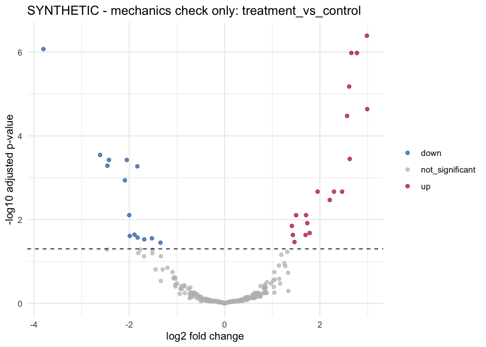

# RNA-seq downstream analysis in R

A parameterized bulk RNA-seq downstream workflow built around DESeq2. It accepts a gene-by-sample count matrix, sample metadata, and an explicit contrast table, then produces sample-level QC, normalized counts, differential-expression results, volcano plots, heatmaps, and an HTML report.

This workflow model was developed during my postdoctoral research at Van Andel Institute. The reusable version in this repository is adapted from my original analysis code and refactored into a portable report, validation helpers, and a synthetic test fixture. The demonstration data and figures below are entirely synthetic and are not Van Andel Institute experimental results.

## Synthetic demonstration



*Synthetic demonstration only. PCA of variance-stabilized counts shows the planted condition-level structure used to test the workflow mechanics.*



*Synthetic demonstration only. DESeq2 results for the planted `treatment_vs_control` comparison verify result classification and plotting; they have no biological interpretation.*

## Requirements

- R
- Pandoc
- CRAN: `rmarkdown`, `knitr`, `ggplot2`
- Bioconductor: `DESeq2` and its dependency `SummarizedExperiment`

Optional human functional enrichment additionally uses `AnnotationDbi`, `clusterProfiler`, `ReactomePA`, and `org.Hs.eg.db`.

## Inputs

- `counts.csv`: `gene_id` followed by non-negative integer sample columns.
- `metadata.csv`: one row per sample, with `sample_id` and categorical design variables.
- `contrasts.csv`: `label`, `factor`, `numerator`, and `denominator`.
- An R configuration file modeled on `config/example_config.R`.

The workflow validates sample matching, CSV headers, additive categorical designs, contrast levels, and output filename safety before fitting the model.

## Run the synthetic example

```sh
git clone https://github.com/elissonnog/rnaseq-downstream-r.git
cd rnaseq-downstream-r
Rscript tests/test_helpers.R
Rscript run_analysis.R config/example_config.R
```

The synthetic fixture can be regenerated deterministically with:

```sh
Rscript example/synthetic/generate_fixture.R
```

To inspect dependency availability without running the analysis:

```sh
Rscript run_analysis.R --check-dependencies
```

## Analysis outline

1. Validate counts, metadata, design, and declared contrasts.
2. Filter genes by the configured minimum total count.
3. Fit the configured additive categorical design with DESeq2.
4. Apply the variance-stabilizing transformation for PCA, correlation, and heatmaps.
5. Export normalized counts and one result table per declared contrast.
6. Generate PCA, correlation, volcano, and contrast-ranked heatmap figures.
7. Optionally run human GO-BP and Reactome enrichment for significant up- and down-regulated genes.

## Outputs

The configured output directory receives:

- `rnaseq_downstream.html`
- `tables/run_metadata.csv`
- `tables/normalized_counts.csv`
- `tables/<contrast>_deseq2.csv`
- `figures/pca.png`
- `figures/sample_correlation.png`
- `figures/<contrast>_volcano.png`
- `figures/<contrast>_top_genes_heatmap.png`
- enrichment tables and identifier-mapping summaries when enrichment is enabled

This repository covers downstream analysis only. Alignment, quantification, and raw-read QC remain upstream. A real worked example should be added only when its data provenance and release permissions are confirmed.

No license has been selected.
